# agora-perp-agent

Autonomous AI trading agent for crypto perpetual futures. Reads live Hyperliquid
markets, decides through an LLM grounded by a deterministic quant core, and
anchors every decision on **Arc testnet** as an
[ERC-8183](https://eips.ethereum.org/EIPS/eip-8183) commerce job — so the track
record is independently verifiable on-chain.

Built for the **Agora Agents Hackathon** (Canteen × Circle × Arc, May 2026).
Paper-trading mode only — prices come from a live public feed, positions track
honest PnL, no real funds are at risk.

— [live dashboard](https://greetingromansoldier.github.io/agora-perp-agent/) —
[sample on-chain anchor](https://testnet.arcscan.app/tx/0x3009e228d1a0f8f35a54509fc0775228a4b83fd012a5bda3dd64177c928e7039)
— MIT licensed · 206 tests passing

______________________________________________________________________

## On-chain proof, in one transaction

Every executed decision lands on Arc as an ERC-8183 `createJob`. The description
carries a human-readable trade summary and a keccak256 anchor over the canonical
audit record:

```
agora-perp-agent · OP long 872.5074 @ 7.4x · $110 notional ·
stop $0.1234 take $0.1345 · tier T3 · regime DN/NRM/NEU ·
audit 7af5d4ca · keccak 0xc423bca3c309a777…3d1b39
```

Anyone holding the off-chain audit record can recompute
`keccak256(canonical_json(record) || nonce)` and compare it to the `keccak`
token on chain. If they match, the decision was committed at that block height —
not edited later.

Circle's MPC custody signs the transaction. The agent process never touches a
private key.

______________________________________________________________________

## Architecture

```mermaid
flowchart LR
  subgraph SENSE ["SENSE · live market state"]
    direction TB
    A1[data<br/>WS L2 + 5m + funding]
    A2[forecast<br/>logistic over ATR/EMA/RSI/ADX]
    A3[cost<br/>fees + √-slippage + funding]
    A4[allocate<br/>rank by edge after cost]
    A1 --> A2 --> A3 --> A4
  end
  subgraph DECIDE ["DECIDE · LLM + math"]
    direction TB
    B1[LLM agent<br/>Gemini 3.1 Pro]
    B2[sizing layer<br/>tier × regime × ATR × leverage]
    B3[risk gate<br/>5-rule veto]
    B1 --> B2 --> B3
  end
  subgraph COMMIT ["COMMIT · verifiable on Arc"]
    direction TB
    C1[paper execute<br/>open + stop/take]
    C2[audit record<br/>keccak256 + nonce → sqlite]
    C3[on-chain anchor<br/>ERC-8183 createJob]
    C4[tx on Arc<br/>arcscan link]
    C1 --> C2 --> C3 --> C4
  end
  A4 --> B1
  B3 --> C1
```



Three phases. The deterministic core (sensing, sizing, risk, execution) is
public Python. The LLM is consulted but never picks size or leverage. The
on-chain anchor commits to the exact state the call was made on.

______________________________________________________________________

## Why this design

- **The math is honest, the LLM is the consultant.** Sizing, leverage, stops,
  and PnL are pure deterministic Python — no model hallucination touches a
  number. The LLM picks _which_ trades to take and explains _why_. It never
  picks _how big_.
- **Decisions are verifiable.** The keccak256 anchor commits to the exact state
  (market snapshot, forecast, cost assessment, sizing inputs) the call was made
  on. Off-chain record + nonce = anyone can re-prove or disprove the call at
  that block.
- **Settlement is cheap.** Arc denominates gas in USDC, fees are micro-cents per
  anchor. Circle's MPC custody signs every transaction.

______________________________________________________________________

## End-to-end loop

Each tick of `cli/run.py`:

01. **Stream** Hyperliquid markets over WebSocket — 10 coins, L2 book + 5m
    candles + funding (`core/ws.py`).
02. **Forecast** next-bar direction via logistic over EMA, SMA, RSI, ADX, ATR,
    realized-vol (`core/forecast.py`).
03. **Cost-model** the round trip: maker/taker bps + sqrt-law slippage from book
    depth + signed funding for the hold horizon (`core/cost.py`).
04. **Rank** by edge after cost (`core/allocate.py`).
05. **LLM agent** emits a structured `Decisions` JSON — per asset, one of
    `enter / hold / cut / flip / skip` plus rationale and cited numbers
    (`core/synthesis.py`).
06. **Size** every `enter` through the trading-context layer: `classify_tier` →
    3-axis regime (trend × vol × funding) → playbook multiplier → vol-targeted
    dollar risk → ATR-derived stop distance → three-cap leverage (venue /
    operational / liq-safety) → funding-drag check (`core/sizing.py`).
07. **Risk-gate**: per-position cap, total exposure cap, edge floor, uniqueness
    (`core/risk.py`).
08. **Execute** in paper mode: `open_sized` registers stop / take on the
    position; `check_stops` fires every tick if mark breaches a level
    (`core/execute.py`).
09. **Audit + anchor**: write-ahead the decision to sqlite, then submit an
    ERC-8183 `createJob` to Arc via Circle's Contract Execution API
    (`agent/audit.py`, `agent/on_chain.py`).
10. **Snapshot + push**: serialize portfolio + activity feed + equity curve to
    `dashboard/data/snapshot.json` and git-push it every minute
    (`agent/snapshot.py`, `agent/auto_push.py`). GitHub Pages serves the
    dashboard; the snapshot file is fetched directly from
    raw.githubusercontent.com so latency is bounded by the push cadence.

______________________________________________________________________

## Status

- [x] L0 — scaffold, tests, eps helpers, project layout
- [x] L1 — data ingestion (Hyperliquid REST + WebSocket, parallel multi-coin
  fetch, 2 s locked meta cache)
- [x] L2 — forecast (baseline logistic over six indicators)
- [x] L3 — cost model (fees + sqrt-law slippage + signed funding)
- [x] L4 — greedy ranked allocation
- [x] L5 — risk gate (5-rule veto: edge / uniqueness / exposure)
- [x] L5.5 — sizing layer (tier × regime × ATR stops × 3-cap leverage + funding
  drag)
- [x] L6 — LLM agent (Gemini 3.1 Pro + rule-based fallback + structured
  rationale + 5 read-only tools)
- [ ] L7 — bounded backtest as agent tool (deferred)
- [x] L8 — sim execution (open / open_sized / close / tick / check_stops +
  funding accrual)
- [x] L9 — Arc receipts via ERC-8183 (live, proven on-chain)
- [x] L10 — static dashboard (GitHub Pages + live snapshot + anchor feed +
  collapsible activity)
- [ ] L11 — Loom demo + Agora submission

**Test coverage**: 206 tests across the engine, all passing under
`uv run --with pytest python -m pytest`.

______________________________________________________________________

## Stack

- **settlement** · Arc — Circle's L1, USDC-as-gas, sub-second finality
- **signing** · Circle Wallets — Developer-Controlled, MPC custody, no key in
  agent process
- **anchor** · ERC-8183 `createJob` — commerce framework repurposed as decision
  log
- **market data** · Hyperliquid public feeds — WebSocket + REST, no API key
- **LLM** · Gemini 3.1 Pro (rule-based fallback included for tests)
- **engine** · Python 3.12 + uv + async loop + sqlite append-only audit
- **crypto** · `eth-utils` keccak256 + `cryptography` RSA-OAEP entity-secret
- **dashboard** · vanilla HTML / CSS / JS, no build step, GitHub Pages

______________________________________________________________________

## Project layout

```
core/                    # engine — deterministic quant math
├─ contracts.py          # frozen dataclasses (MarketData, SizedCandidate, ...)
├─ data.py / ws.py       # Hyperliquid REST + WebSocket sources
├─ forecast.py           # BaselineForecast (logistic)
├─ cost.py               # CostModel (sqrt-law slippage + funding)
├─ allocate.py           # greedy ranked allocation
├─ risk.py               # 5-rule veto gate
├─ sizing.py             # TierRegimeSizer (8-step pipeline)
├─ regime.py             # BaselineRegimeClassifier + BTC override
├─ tiers.py              # classify_tier
├─ stops.py              # derive_stops_takes
├─ leverage.py           # choose_leverage (3-cap pipeline)
├─ execute.py            # SimExecutor (paper trading)
├─ synthesis.py          # Synthesizer Protocol + Rule / Gemini impls
├─ agent_tools.py        # LLM read-only tool surface
├─ indicators.py         # SMA / EMA / ATR / RSI / ADX / realized-vol
└─ eps.py                # CROSS_EPS = 1e-12 helpers

agent/                   # on-chain anchor + audit + snapshot infra
├─ audit.py              # AuditRecord schema, keccak256+nonce, sqlite WAL
├─ on_chain.py           # CircleAnchor — ERC-8183 via Circle API
├─ anchor_worker.py      # background queue draining records → Arc
├─ snapshot.py           # dashboard JSON writer + hydrate from sqlite
├─ auto_push.py          # periodic git commit + push of snapshot.json
└─ arc_constants.py      # verified Arc Testnet addresses + topic hashes

cli/run.py               # canonical agent runner (live paper trader)

scripts/
├─ circle_setup.py       # one-time Circle Wallet provisioning
└─ smoke_anchor.py       # end-to-end live test of the anchor pipeline

dashboard/               # static GitHub Pages site
├─ index.html / styles.css / app.js
└─ data/snapshot.json    # written by the running agent

tests/                   # pytest — 206 tests
```

Tuned alpha (regime-conditioned weight sets, Optuna sweeps) lives in a private
repo. The public engine ships the baseline implementation that follows
documented quant-research literature literally — the tuning is what we protect,
the math itself isn't.

______________________________________________________________________

## Run it locally

```bash
# install uv (skip if you have it)
curl -LsSf https://astral.sh/uv/install.sh | sh

# clone + test
git clone https://github.com/greetingromansoldier/agora-perp-agent
cd agora-perp-agent
uv run --with pytest python -m pytest          # all 206 should pass

# credentials
cp .env.example .env
# Edit .env:
#   GEMINI_API_KEY — free at aistudio.google.com
#   CIRCLE_API_KEY — Test API Key from console.circle.com (only for
#                    on-chain anchoring; testnet only, no real money)

# one-time Circle Wallet provisioning (skip if no on-chain)
uv run --with httpx --with cryptography python scripts/circle_setup.py
# Paste the printed ciphertext into Circle Console →
# Web3 Services → Wallets → Register Entity Secret, then re-run.
# Then claim testnet USDC at faucet.circle.com.

# smoke-test the anchor pipeline (optional)
uv run --with httpx --with ccxt --with cryptography \
       --with eth_utils --with pycryptodome \
       python scripts/smoke_anchor.py

# run the live paper trader
uv run --with httpx --with ccxt --with google-genai \
       --with cryptography --with eth_utils --with pycryptodome \
       python cli/run.py --agent gemini --on-chain --auto-push \
                         --starting-balance 10000 --base-risk 0.02 \
                         --max-leverage 20 --max-notional 50000 \
                         --max-exposure 200000
```

Terminal shows a live board + AGENT TRACE in place. The dashboard at
`dashboard/index.html` (served via `python -m http.server -d dashboard` or the
deployed GitHub Pages URL) shows positions, equity curve, decisions with
on-chain links, and the live activity feed.

`cli/run.py --help` lists every flag — leverage cap, base risk, hold horizon,
agent cadence, snapshot interval, etc.

### Without on-chain anchoring

Skip `--on-chain` and steps 4-5 if you just want to watch the agent trade.
Everything else still works against real-time Hyperliquid prices.

______________________________________________________________________

## License

MIT — see [`LICENSE`](LICENSE).

Arc Testnet contract addresses and ERC-8183 event topic hashes were verified
against the [Arcadia](https://github.com/magooney-loon/arcadia) indexer
(Apache-2.0). Their running production indexer is the implicit attestation that
the proxy addresses resolve correctly.
